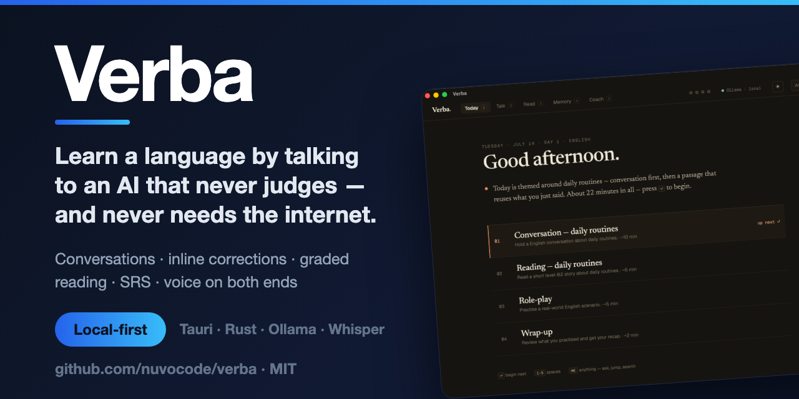
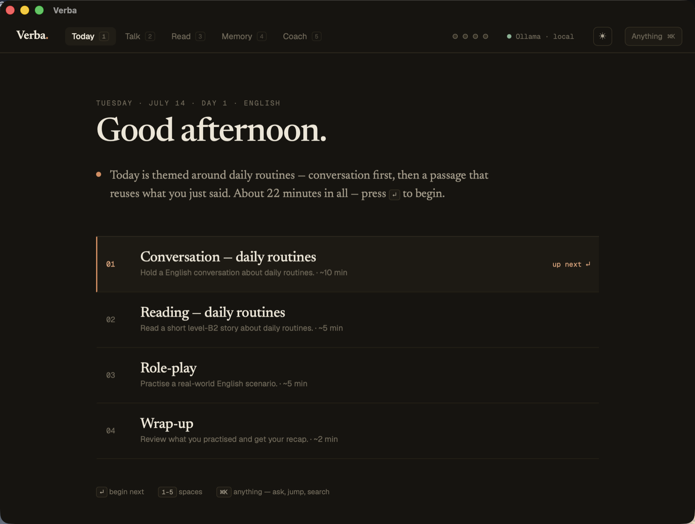
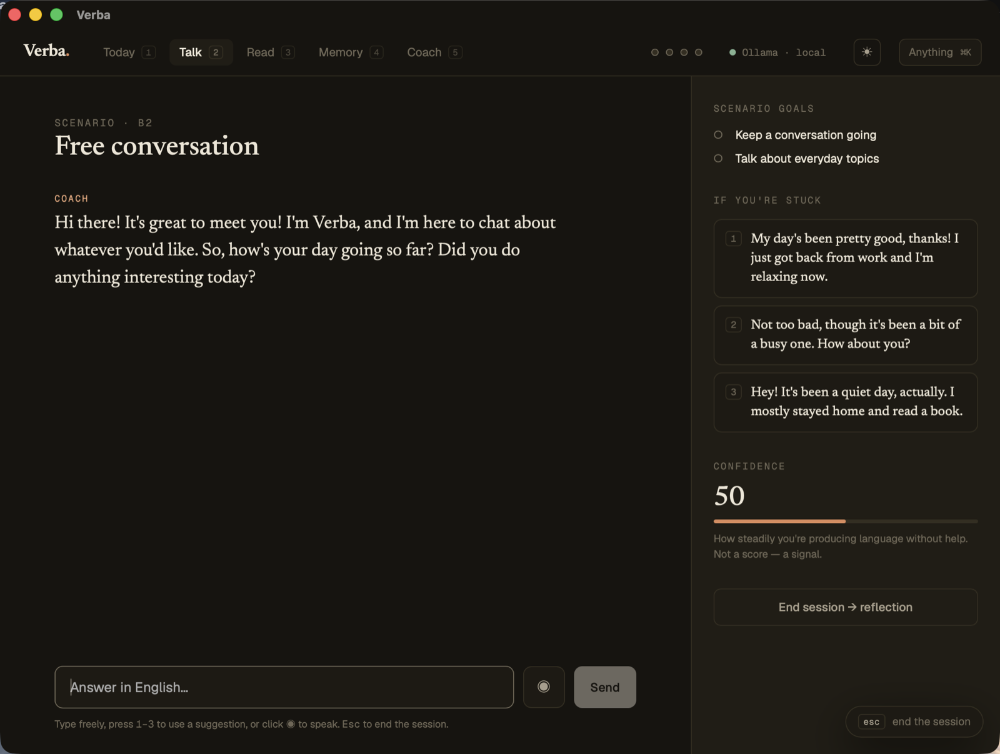
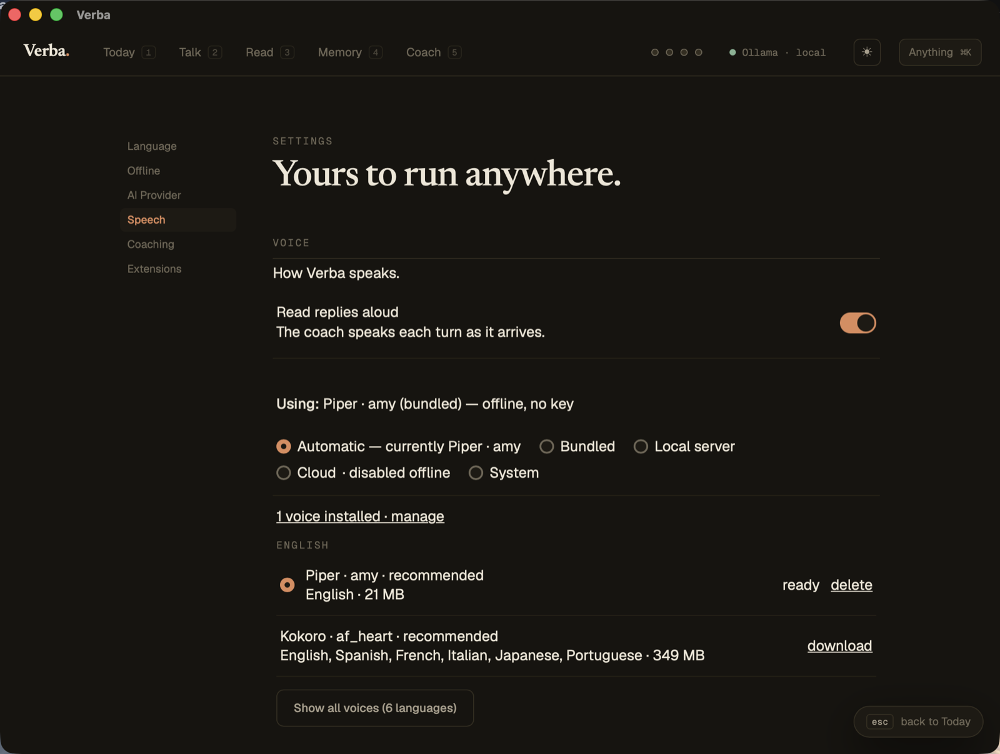

<div align="center">

# Verba

**Learn a language by talking to an AI that never gets bored, never judges,
and — if you want — never touches the internet.**

Full conversations with inline corrections, AI-generated graded reading, automatic
vocabulary capture, and a voice on both ends. Runs entirely on your machine.

[](https://github.com/nuvocode/verba/releases/latest)
[](./LICENSE)
[](#download)

<a href="https://youtu.be/5JQC3_omELw"></a>

<sub><a href="https://youtu.be/5JQC3_omELw">▶︎ Click to play — one session end to end: talk, get corrected, hear the reply.</a></sub>

</div>

---



**A session is a plan, not a menu.** One theme threads today's conversation,
reading, role-play, and the words that are due.



**The coach speaks first and keeps the turn moving.** Suggestions are there for the
moment you stall — not to answer for you.



**Voice and dictation, no setup.** A 21 MB voice running inside the app: no key, no
server, nothing on the network.

---

## Why Verba

- **Offline, genuinely.** Point it at [Ollama](https://ollama.com) and the whole app
  — chat, reading, speech, dictation — works on a plane. No account, ever.
- **Your provider, your key.** Ollama, LM Studio, OpenAI, Anthropic, Gemini,
  OpenRouter. Swap in Settings; nothing is locked in.
- **It talks back.** Speak, get transcribed, get answered out loud. The bundled
  models download on demand and run in-process.
- **It remembers.** Words you stumble on become a spaced-repetition deck, and the
  deck feeds tomorrow's session.
- **Your data stays put.** Everything lives in a local SQLite file. There is no
  server to sign up to, because there is no server.
- **Eight languages, and adding one is a folder.** English, Spanish, French, German,
  Japanese, Turkish, Italian, Portuguese — see [CONTRIBUTING.md](./CONTRIBUTING.md).

## Download

**[→ Latest release](https://github.com/nuvocode/verba/releases/latest)**

| Platform | | |
|---|---|---|
| **macOS** — Apple Silicon (M1–M4) | [`.dmg`](https://github.com/nuvocode/verba/releases/download/v0.1.0/Verba_0.1.0_aarch64.dmg) | |
| **macOS** — Intel | [`.dmg`](https://github.com/nuvocode/verba/releases/download/v0.1.0/Verba_0.1.0_x64.dmg) | |
| **Windows** | [`.exe`](https://github.com/nuvocode/verba/releases/download/v0.1.0/Verba_0.1.0_x64-setup.exe) | [`.msi`](https://github.com/nuvocode/verba/releases/download/v0.1.0/Verba_0.1.0_x64_en-US.msi) |
| **Linux** | [`.AppImage`](https://github.com/nuvocode/verba/releases/download/v0.1.0/Verba_0.1.0_amd64.AppImage) | [`.deb`](https://github.com/nuvocode/verba/releases/download/v0.1.0/Verba_0.1.0_amd64.deb) · [`.rpm`](https://github.com/nuvocode/verba/releases/download/v0.1.0/Verba-0.1.0-1.x86_64.rpm) |

On a Mac, take **aarch64** for Apple Silicon and **x64** only for an Intel Mac — the
wrong one either refuses to start or crawls under Rosetta.

<details>
<summary><b>The build is unsigned — here's how to open it anyway</b></summary>

<br>

Verba has no Apple Developer certificate and no Windows code-signing certificate, and
we would rather ship the build than gate it behind either. So both operating systems
will refuse to open it on the first try.

**macOS** says *"Apple could not verify 'Verba' is free of malware"* and offers you
**Move to Trash**. That is not a detection — nothing was scanned and nothing was
found. It is what macOS says about *any* app that hasn't been through Apple's
notarisation service. Drag Verba to `/Applications`, then:

```bash
xattr -dr com.apple.quarantine /Applications/Verba.app
```

Without a terminal: try to open it once, then **System Settings → Privacy & Security**
→ scroll down → **Open Anyway**. (On macOS 15+ the old right-click → *Open* trick no
longer works.)

**Windows** SmartScreen shows *"Windows protected your PC"* → **More info** → **Run
anyway**.

Building it yourself sidesteps both, and is the honest option if the above makes you
uncomfortable. None of this is unique to Verba — it's the toll every unsigned
open-source desktop app pays.

</details>

## First run

1. Pick a **language pack** and a **provider** in Settings. `Test connection` lists
   your installed Ollama models.
2. Optional — **Settings → Speech → Bundled models** downloads a voice and a
   transcriber that run inside the app:

   | | Model | Size | Speed |
   |---|---|---|---|
   | Voice | **Piper** — one voice per language | ~21 MB | ~7× real time |
   | Voice | **Kokoro** — 53 voices, six languages | 349 MB | ~2× real time |
   | Dictation | **Whisper** base / small | 208 / 639 MB | faster than real time |

   Piper is the default a pack recommends — a fiftieth of the download and several
   times quicker, which for a conversation turn matters more than the last few
   percent of naturalness.

3. Hit 🎤 in Talk and say something.

Already run your own speech server, or prefer a cloud voice? Any OpenAI-compatible
server works (Kokoro-FastAPI, speaches, LocalAI, vLLM), as do ElevenLabs and Deepgram
keys. Verba walks **bundled → local server → cloud key → OS voice** and always tells
you which tier is actually speaking.

> **Platform honesty:** all four targets are packaged from the same source by CI, but
> the bundled speech engine has only ever *run* on macOS arm64. If you are the first
> to run it on Windows or Linux and no voice comes out, that's a bug worth reporting —
> not you doing it wrong.

## Build from source

Needs Node and Rust; for offline, [Ollama](https://ollama.com) running.

```bash
npm install
npm run tauri dev      # develop
npm run tauri build    # package
```

## More

- **[What's inside](./docs/architecture.md)** — the design, the speech ladder, the
  trade-offs we took and what they cost.
- **[Contributing](./CONTRIBUTING.md)** — especially language packs. Adding a language
  is a folder and one import line.
- **License:** [MIT](./LICENSE). Fork it, bundle it, ship it inside your own tool.
